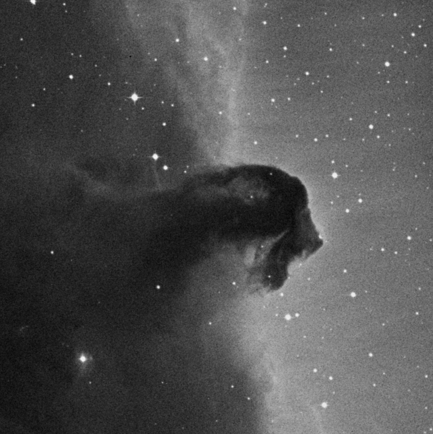
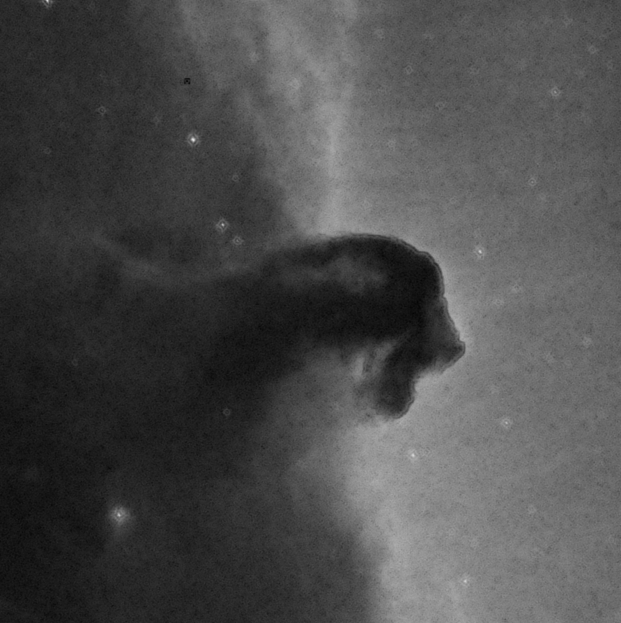
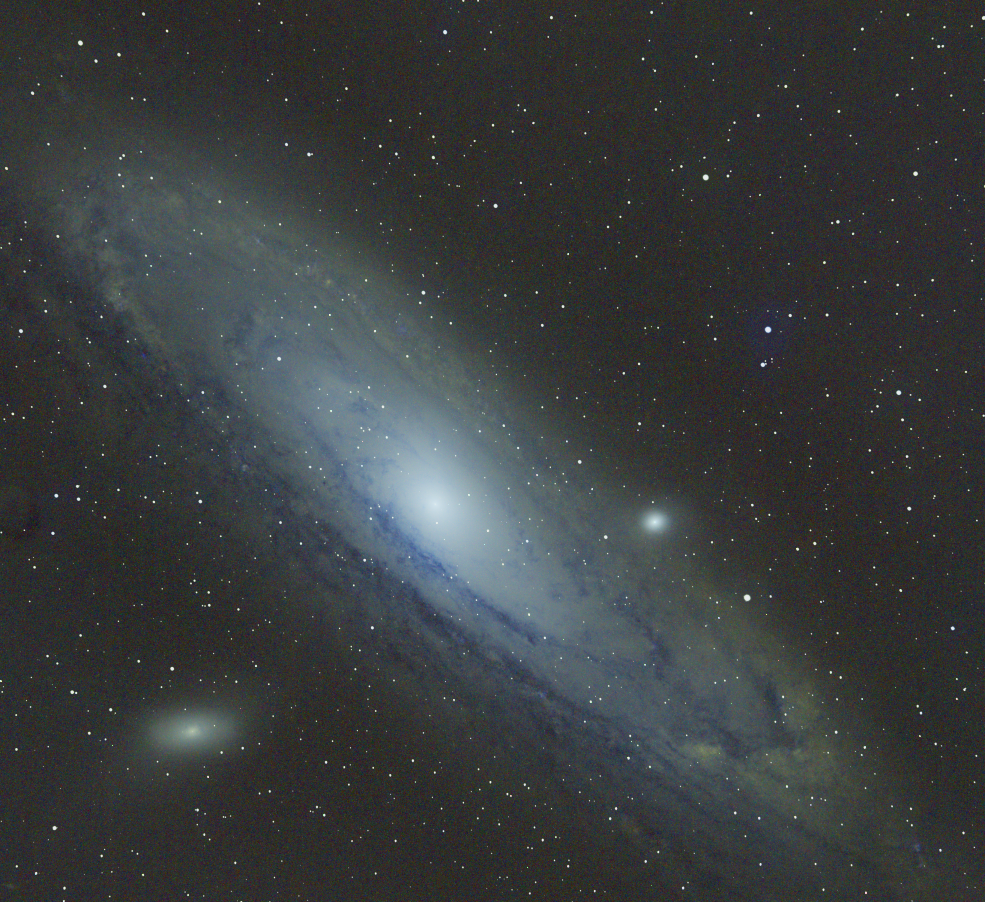
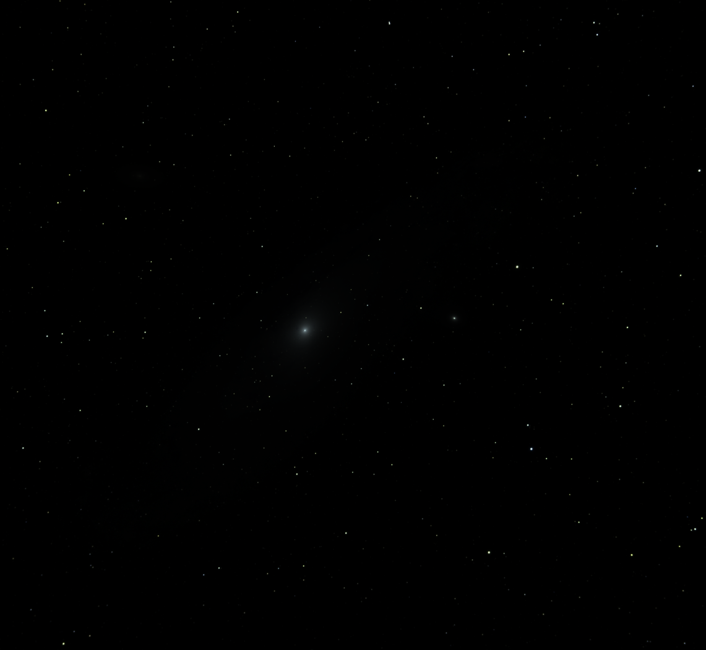
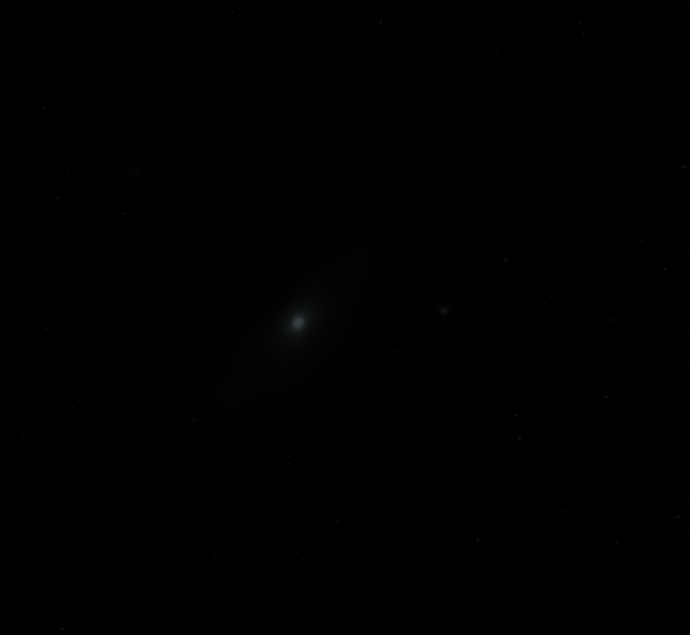
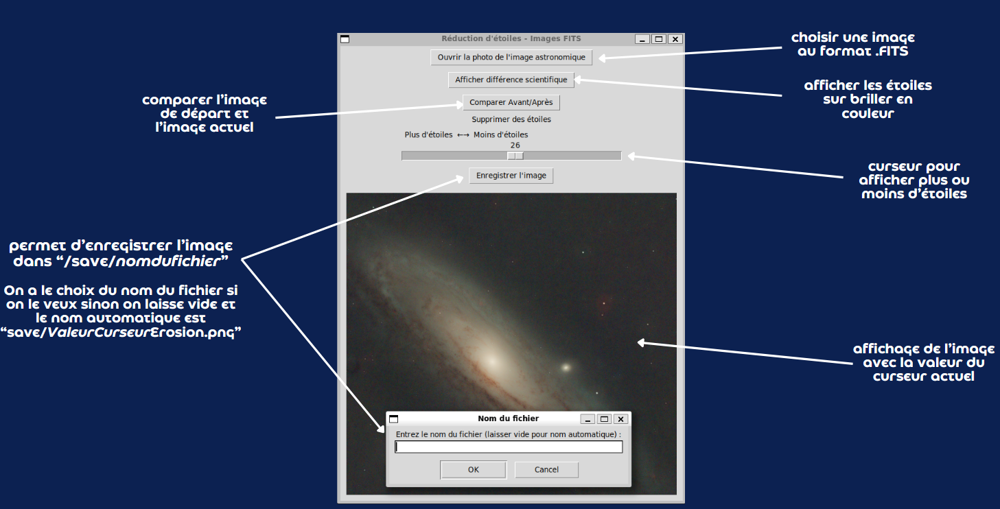

# SAE S3.C2 : Réduction d'étoiles en astrophotographie

## Groupe N°9 : Valentine, Thomas, Gabin

## Informations

⚠️ Pour les utilisateurs Windows : nous recommandons fortement d’installer WSL (Windows Subsystem for Linux) pour une meilleure compatibilité et performance avec les outils Unix/Linux. Vous pouvez suivre la documentation officielle : 
https://learn.microsoft.com/fr-fr/windows/wsl/install 

Avec WSL, vous pouvez utiliser directement les commandes Linux du README original, ce qui est plus proche des environnements utilisés en astrophotographie scientifique.

## Présentation du projet

Développement d'un outil de **réduction d'étoiles** pour l'astrophotographie qui réduit le diamètre apparent des étoiles sans altérer les structures des nébuleuses. Notre implémentation suit la méthodologie du sujet avec trois outils complémentaires : 

1. **`erosion.py`** – Script batch pour traitement automatique d’un fichier FITS.  
2. **`erosionGraphique.py`** – Interface graphique interactive pour ajuster la réduction des étoiles en temps réel.  
3. **`batch_processing.py`** – Traitement par lots de plusieurs fichiers FITS.  

---

## Installation

### Prérequis système

- **Python 3.8+**  
- Tkinter pour l'interface graphique :

```bash
sudo apt update
sudo apt install python3-tk
```

```bash
sudo apt install python3.12-venv
```

Création d’un environnement virtuel :

```bash
python -m venv venv
source venv/bin/activate   # Windows : venv\Scripts\activate
```

# Dépendances Python

Installer via pip :

```bash
pip install -r requirements.txt # Attendre jusqu'a que le terminal vous affiche "Successfully installed ...", votre terminal reviendra ensuite a "(venv) user@user:...$"
```

Ou manuellement :

```bash
pip install astropy opencv-python photutils matplotlib numpy pillow tqdm
```

# Utilisation
## 1. Script batch : `erosion.py`

```bash
python3 erosion.py
```

Fonctionnement :    
-  Lecture d’un fichier FITS (test_M31_linear.fits)

- Normalisation et conversion pour OpenCV

- Détection des étoiles par seuillage adaptatif

- Réduction des étoiles via érosion morphologique

- Interpolation masquée pour préserver les détails

- Sauvegarde dans results/ :

- - `original.png` : image normalisée

- - `star_mask.png` : masque binaire des étoiles

- - `eroded.png` : image érodée

- - `final.png` : image finale


## 2. Interface graphique : `erosionGraphique.py`

```bash
python3 erosionGraphique.py
```

Fonctionnalités :

- Ouverture de fichiers FITS mono ou multi-canaux

- Curseur pour contrôler l’intensité de réduction (0-50)

- Comparaison avant/après (mode clignotement)

- Visualisation de la différence scientifique (zones modifiées en couleur)

- Sauvegarde automatique en PNG dans save/

## 3. Traitement par lots : `batch_processing.py`

```bash
python3 batch_processing.py --input examples --output results --strength 3
```

Fonctionnement :

- Parcourt tous les fichiers FITS du dossier `--input`

- Sauvegarde les images originales et réduites dans `--output`

- Applique la réduction des étoiles avec la force `--strength`

# Méthodes utilisées

## 1. Normalisation des données FITS
Conversion des valeurs d’intensité entre 0 et 1 pour le traitement avec OpenCV.

## 2. Détection des étoiles

- Conversion en niveaux de gris si nécessaire

- Flou gaussien pour réduire le bruit

- Seuillage adaptatif pour créer un masque binaire des étoiles

## 3. Réduction des étoiles

- Érosion morphologique sur les zones détectées

- Lissage du masque pour des transitions douces

- Interpolation finale pour combiner image originale et image érodée

## 4. Interface graphique

- Tkinter pour l’affichage et l’interaction

- Curseur pour ajuster la force de réduction

- Fonction blink pour alternance avant/après

- Carte de différence scientifique pour visualiser les modifications

# Résultats

- Images traitées avec réduction des étoiles tout en conservant les détails des nébuleuses

- Masques binaires pour identifier les étoiles détectées

- Comparaison avant/après avec mode clignotement

- Différence scientifique enregistrée dans `results/etoiles.png`

**Voici les différents avant/après :**

Image : HorseHead




Image : test_M31_linear




Image : test_M31_raw




Image de l'application 



# Difficultés rencontrées et solutions

## Problèmes 

- 1. Conversion entre espaces colorimétriques (RGB ↔ BGR)

- 2. Gestion des images mono vs multi-canaux
 
- 3. Optimisation des performances pour grandes images

- 4. Création de transitions douces dans le masque

## Solutions 

1. Conversion entre espaces colorimétriques (RGB ↔ BGR)

Conversion explicite entre les espaces selon le contexte :

```bash
# Dans erosion.py
img_cv = cv2.cvtColor(img_cv, cv2.COLOR_RGB2BGR)  

# Dans erosionGraphique.py
img_rgb = cv2.cvtColor(img_cv, cv2.COLOR_BGR2RGB)  
```


2. Gestion des images mono vs multi-canaux

Vérification du nombre de dimensions et réorganisation si nécessaire :

```bash
# Vérification et adaptation
if img_data.ndim == 3:
    if img_data.shape[0] == 3: 
        img_data = np.transpose(img_data, (1, 2, 0)) 
```

3. Optimisation des performances pour grandes images

Utilisation d’un flou gaussien léger pour lisser le masque et le convertir directement en float, ce qui accélère les :

```bash
mask_smooth = cv2.GaussianBlur(star_mask, (5,5), 0)  
mask_float = mask_smooth.astype(np.float32) / 255.0  
```


4. Création de transitions douces dans le masque

Lissage du masque après seuillage adaptatif pour créer une transition progressive entre les étoiles et le fond :

```bash
# Dans erosion.py

# Création du masque binaire pour les étoiles
star_mask = cv2.adaptiveThreshold(
    img_blur, 255, cv2.ADAPTIVE_THRESH_GAUSSIAN_C, cv2.THRESH_BINARY, 25, -2
)

# Lissage du masque pour transitions douces
mask_smooth = cv2.GaussianBlur(star_mask, (5,5), 0)
mask_float = mask_smooth.astype(np.float32) / 255.0
```

```bash
# Dans erosionGraphique.py

# Création du masque binaire
star_mask = cv2.adaptiveThreshold(
    img_blur, 255,
    cv2.ADAPTIVE_THRESH_GAUSSIAN_C,
    cv2.THRESH_BINARY, 15, -2
)

# Lissage du masque
mask_smooth = cv2.GaussianBlur(star_mask, (5, 5), 0)
mask_float = mask_smooth.astype(np.float32) / 255.0
```

# Livrables fournis

Code source commenté : `erosion.py`, `erosionGraphique.py`, `batch_processing.py`

Documentation : `README.md`

Images de test et résultats : `examples/` et `results/`

Dépendances : `requirements.txt`
